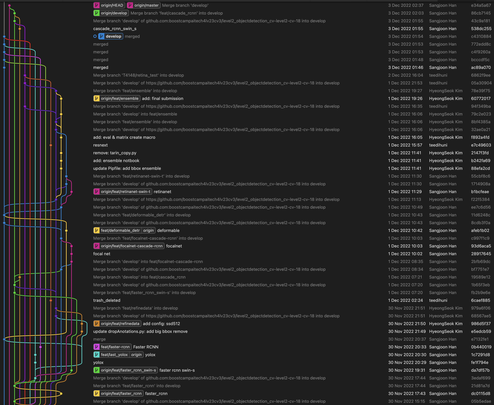
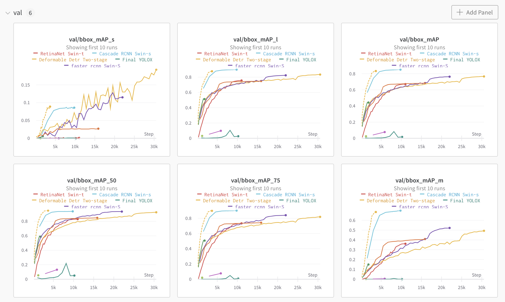
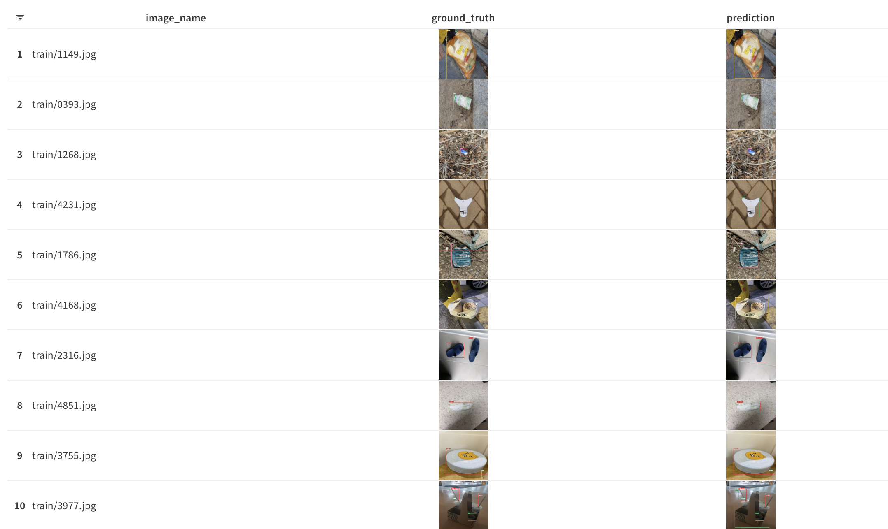
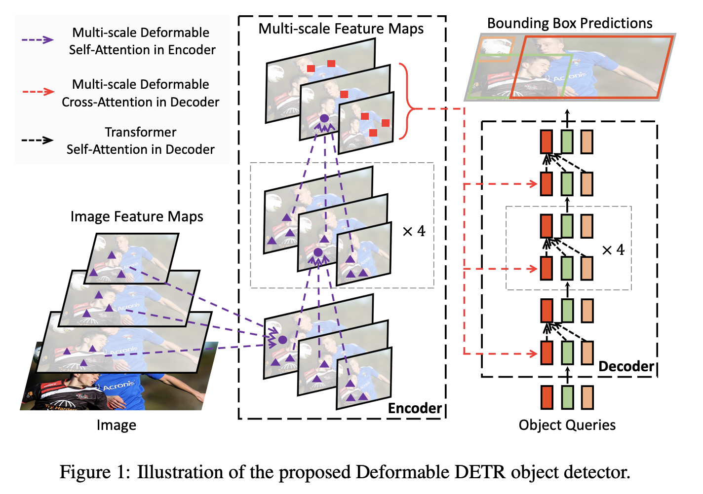
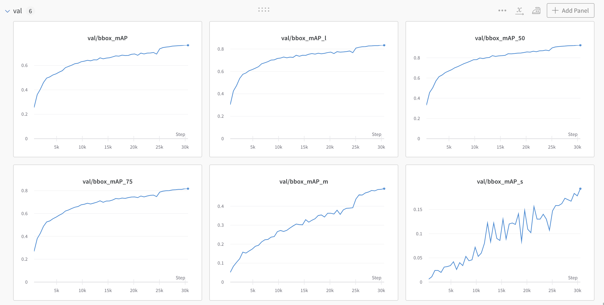
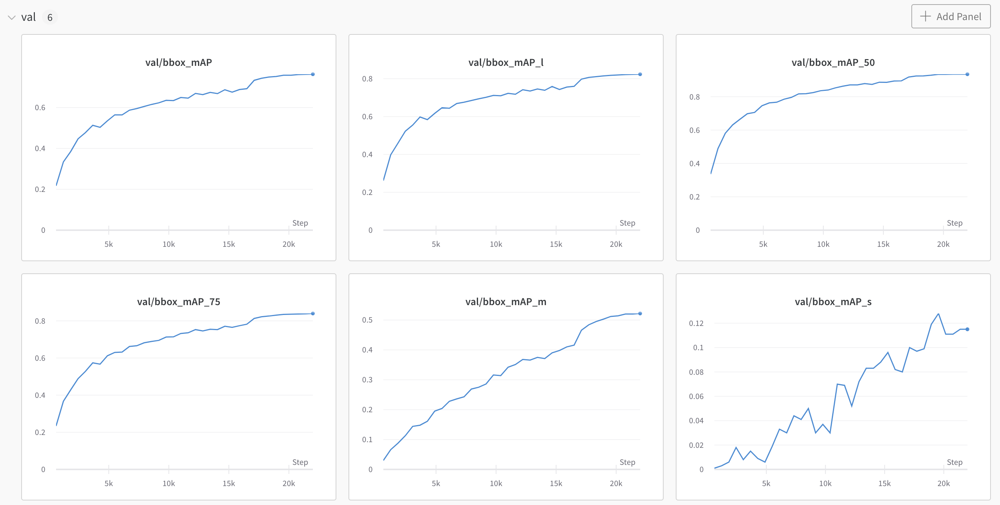
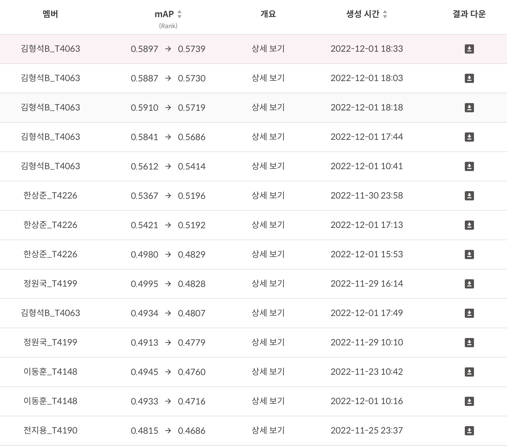

# 재활용 품목 분류를 위한 Object Detection

---

## install

- 환경 구성에 필요한 package 설치
- mmcv 설치(pipenv로 직접설치 안됨)

```bash
pipenv install
pipenv run mim install mmcv-full
```

- mmcv와 mmdetection이 제대로 설치되었는지 확인
- [.local/README.md](.local/README.md) 참조


[train]
python train.py configs/~~

[inference]
python test.py configs/~~ work_dirs/~ /latest.pth 

---

# 재활용 품목 분류를 위한 Object Detection - Wrapup Report

---

---

## 프로젝트 개요

### 설명

- 바야흐로 대량 생산, 대량 소비의 시대. 우리는 많은 물건이 대량으로 생산되고, 소비되는 시대를 살고 있습니다. 하지만 이러한 문화는 '쓰레기 대란', '매립지 부족'과 같은 여러 사회 문제를 낳고 있습니다.
- 분리수거는 이러한 환경 부담을 줄일 수 있는 방법 중 하나입니다. 잘 분리배출 된 쓰레기는 자원으로서 가치를 인정받아 재활용되지만, 잘못 분리배출 되면 그대로 폐기물로 분류되어 매립 또는 소각되기 때문입니다.
- 따라서 우리는 사진에서 쓰레기를 Detection 하는 모델을 만들어 이러한 문제점을 해결해보고자 합니다. 문제 해결을 위한 데이터셋으로는 일반 쓰레기, 플라스틱, 종이, 유리 등 10 종류의 쓰레기가 찍힌 사진 데이터셋이 제공됩니다.
- 여러분에 의해 만들어진 우수한 성능의 모델은 쓰레기장에 설치되어 정확한 분리수거를 돕거나, 어린아이들의 분리수거 교육 등에 사용될 수 있을 것입니다. 부디 지구를 위기로부터 구해주세요! 🌎

### 평가

- Test set의 mAP50으로 평가
- mAP


---

## 프로젝트 팀 구성 및 역할

- T4063 김형석
    - Ensemble, EDA, SSD 훈련 및 평가, 조건부 Annoation 삭제 기능, Submission 생성 자동화, Confusion Matrix 생성 자동화
- T4148 이동훈
    - EDA, class relabeling, retina model 다양하게 실험.
- T4190 전지용
    - EDA, Model 탐색, Small Object 탐지 전략, Overlapping Objcet 탐지 전략
- T4199 정원국
    - EDA, Loss, Faster RCNN, WandB, Data split, Heavy Augmentation, Mosiac Augmentation, K-fold
- T4226 한상준
    - Train 셋 분석 툴 개발, Model 탐색 (Deformable DETR with R50, Faster-RCNN with Swin-S, RetinaNet with Swin-T)

---

## 프로젝트 수행 절차 및 방법

### 1. 협업 방식

- Github 활용
    - Custom gitlab-flow 적용
        - Master 브랜치 / Develop 브랜치를 기본으로 하고, 각자 실험이 필요한 경우는 Feat/실험명 또는 EDA/분석명 등과 같은 서브 브랜치를 생성하는 방식으로 Git 충돌을 회피하고자 하였다. 실제 협업중에 Merge 에 필요한 Overhead 는 발생하지 않았고, 팀원 각자의 Learning curve 도 높지 않아 빠르게 적응할 수 있었다.
        
        
        
        
        
- WandB 실험 관리
    - MMDetection을 이용한 Object detection 결과를 한 곳에서 취합하여 성능을 비교하기 위하여 WandB 를 사용하였고, 모델간의 특성을 비교하거나 성능을 비교하는데 큰 도움이 되었다.
    
    
    
    
    

### 2. 접근 전략

EDA 전략 → 모델 탐색 전략 → 앙상블 전략

### 3. 수행 과정

[Untitled](https://www.notion.so/22603479e63e4af3a730626250fe9c7b)

---

## 프로젝트 수행 결과

### 1. 데이터 분석

- Raw Image Size Analysis
    - Train Dataset
        
        
        |  | width | height | license | id | width_real | height_real |
        | --- | --- | --- | --- | --- | --- | --- |
        | count | 4883.0 | 4883.0 | 4883.0 | 4883.000000 | 4883.0 | 4883.0 |
        | mean | 1024.0 | 1024.0 | 0.0 | 2441.000000 | 1024.0 | 1024.0 |
        | std | 0.0 | 0.0 | 0.0 | 1409.745012 | 0.0 | 0.0 |
        | min | 1024.0 | 1024.0 | 0.0 | 0.000000 | 1024.0 | 1024.0 |
        | 25% | 1024.0 | 1024.0 | 0.0 | 1220.500000 | 1024.0 | 1024.0 |
        | 50% | 1024.0 | 1024.0 | 0.0 | 2441.000000 | 1024.0 | 1024.0 |
        | 75% | 1024.0 | 1024.0 | 0.0 | 3661.500000 | 1024.0 | 1024.0 |
        | max | 1024.0 | 1024.0 | 0.0 | 4882.000000 | 1024.0 | 1024.0 |
    - Test Dataset
        
        
        |  | width | height | license | id | width_real | height_real |
        | --- | --- | --- | --- | --- | --- | --- |
        | count | 4871.0 | 4871.0 | 4871.0 | 4871.000000 | 4871.0 | 4871.0 |
        | mean | 1024.0 | 1024.0 | 0.0 | 2435.000000 | 1024.0 | 1024.0 |
        | std | 0.0 | 0.0 | 0.0 | 1406.280911 | 0.0 | 0.0 |
        | min | 1024.0 | 1024.0 | 0.0 | 0.000000 | 1024.0 | 1024.0 |
        | 25% | 1024.0 | 1024.0 | 0.0 | 1217.500000 | 1024.0 | 1024.0 |
        | 50% | 1024.0 | 1024.0 | 0.0 | 2435.000000 | 1024.0 | 1024.0 |
        | 75% | 1024.0 | 1024.0 | 0.0 | 3652.500000 | 1024.0 | 1024.0 |
        | max | 1024.0 | 1024.0 | 0.0 | 4870.000000 | 1024.0 | 1024.0 |
- Category Histogram Analysis
    
    
    
- RGB Component Analysis by Category
    - Average, Std by Channel for red
    
    
    
    
    
    - Average, Std by Channel for green
    
    
    
    
    
    - Average, Std by Channel for blue
    
    
    
    
    
    - RGB Average
        
        
        
    
    - RGB Mean
        
        
        
    
    - RGB Std.
        
        
        
- Annotation per Image Analysis


- Size Analysis by Category
    
    
    Width & Height
    
    
    
    Category ID & W/H Ratio
    
    
    

### 2. 모델 탐색

1. 개별 최적 모델 탐색
    - Backbone
        - Swin 계열, Resnet50, Resnext, Darknet, …
    - Model
        - RetinaNet, YOLOX, FPN, R-CNN, Cascade R-CNN, Deformable, DETR, SSD…
2. 단일 모델 Top-2
    1. Deformable DETR (Backbone : Resnet 50)
        1. 모델 구조
            
            
            
        2. 학습 결과
            
            
            
        3. 모델에 대한 고찰
            - 백본으로 Resnet-50을 사용하고, Neck / Head 구조는 Deformable DETR 을 채택하였고, Two-stage 와 One-stage가 모두 가능한 구조여서 본 실험에서는 Two-stage로 실험을 하게 되었다.
            - MMDetection에서 Pre-trained model weight 를 제공하고 있어서, weight 를 불러오지 않았을 때에 비하여 모델의 빠른 수렴을 얻을 수 있었다.
            - Soft NMS 를 적용함에 따라 최종 추론하는 Boundary Box를 유효하게 늘릴 수 있었고, mAP의 향상이 있었다.
    2. Faster RCNN (Backbone : Swin-S)
        1. 모델 구조
            
            
            
        2. 학습 결과
            
            
            
        3. 모델에 대한 고찰
            - 가장 좋은 결과를 내고 있었던 Faster-RCNN 모델에 백본을 Swin Transformer S 로 변경하여 학습을 진행하였고, Resnet-50 과 비교하여 Overfitting이 지연되고, 학습 셋의 특징을 더 잘 수렴할 수 있었다.
            - MMDetection에서 Pre-trained model weight 를 제공하고 있어서, weight 를 불러오지 않았을 때에 비하여 모델의 빠른 수렴을 얻을 수 있었다.
            - Soft NMS 를 적용함에 따라 최종 추론하는 Boundary Box를 유효하게 늘릴 수 있었고, mAP의 향상이 있었다.

### 3. Image Size

- Train Image Size
    - EDA를 통해 작은 BBox가 많은 것을 확인
    - 원본 데이터 정보 손실을 최대한 줄이기 위해 (512, 512) 보다 더 큰 사이즈로 학습 및 추론
- Image slice
    - (1024, 1024) 원본의 정보를 그대로 활용할 수 있도록 이미지를 분할하여 학습
    - Test image 또한 분할하여 추론하고 추출된 결과를 합병
    - 학습 과정에서는 성능이 좋아지는 듯 보였으나 합병하는 과정에서 Overlapping Object의 정보의 손실이 발생하여 오히려 낮은 결과를 보임

### 4. Overlapping Object Detection S**trategy**

- Soft NMS
    - 기존 NMS 방식을 Soft NMS 방식으로 바꿔 Overlapping Object를 탐지 할 수 있도록 변경
- Confidence Score
    - Confidence thresold를 낮춰 많은 BBox를 검출하여 Overlapping Object를 검사할 수 있게 추론
- NMS IoU thresold
    - IoU thresold를 낮춰 가장 점수가 높은 Bbox와 근처의 Bbox까지 더 찾아질 수 있도록 변경

### 5. Augmentation

- 모델이 Overfitting 되는 경향을 파악, 추가되는 Augmentation의 장점과 모델에 가해지는 단점을 전부 생각한 후 적용 유무를 결정
    - **ShiftScaleRotate →** Overfitting을 막기위해 데이터 증강의 방법으로서 진행
    - **RandomBrightnessContrast →** 이미지 EDA결과 밝기와 대조가 올라가면 이미지 구분이 더 잘 될 것이라는 판단 하에 진행.
    - **RGBShift →** RGB 값을 조정하여 원하는 Object가 더 눈에 띄고 모델이 잘 찾아낼 수 있게 함
    
                              다만 값을 크게 줄 경우 오히려 방해가 되므로 적정 한 값을 테스트를 통해 찾아냄
    
    - **HueSaturationValue →** HSV 값을 조정하여 원하는 Object가 더 눈에 띄고 모델이 잘 찾아낼 수 있게 함
    
                                                 RGBShift와 마찬가지로 적정 한 값을 테스트를 통해 찾아냄
    
    - **JpegCompression →** 이미지 품질을 낮춰서 강선성을 높이고자 함, 품질이 낮아지는 면이 걱정되었지만 단일 이미지에 적용 후 확인해보니 괜찮다고 판단
    - **ChannelShuffle →** 무작위로 채널을 섞어줘서 강건성을 높이고자 함
    - **Blur** → Drop out 과 같은 효과를 주어 모델의 강건성을 높이고자 함.
    - **MedianBlur →** Noise를 어느정도 제거하고자 하였음, ****다만 화질이 뭉쳐 있는 부작용이 일어날 수 있으나 Task를 수행하는 데는 큰 영향이 없다고 판단

### 6. Model Ensemble

- Ensemble Method
    - NMS(None Maximum Suppression) 사용
    
    
    
- Ensemble Parameter : IOU Threshold
    - IOU가 해당 Threshold이상인 것만 Ensemble 수행
    - Parameter Search : 이진 탐색 기법으로 접근, Submission을 통해 최적 Threahold 추정
        - IOU 0.5 → IOU 0.9 → IOU 0.7 → IOU 0.6 → **IOU 0.55(Best)**

### 7. 리더보드 제출 평가 (최종)



- Deformable DETR (R50) 과 Faster-RCNN (Swin-S), Faster-RCNN (800x600, soft_nms,treshold 0.1 ) 모델을 IoU Threshold 0.55 로 NMS 하여 앙상블한 결과를 제출한 것이 최종 제출에서 가장 좋은 결과를 얻게 되었다.
- 이는, Neck이 트랜스포머인 경우, 백본이 트랜스포머인 경우 등 서로 다른 특성을 가지는 모델을 앙상블 하였기에 다양성을 이끌어 낼 수 있었으며, mAP 를 계산하는데 있어 Precision을 높을 수 있었다고 평가하고 있다.

---

## 자체 평가 의견

### 1. 결과 분석

- Backbone 만 Pretrained 모델을 사용한 것 보다 전체 Architecture의 Pretrained 모델을 가져오는 것이 더 학습에 효과적이였다.
    - Backbone 만이 아닌 Neck, head 부분도 Task에 적합한 Pretrained 모델을 사용했다면 더 좋은 결과를 얻을 수 있을 것이라 생각됨
- 추론된 Bbox가 많을 수록 더 높은 mAP 성능을 보임
    - mAP가 높아도 결과 이미지 시각화 시 원하는 모습을 보이지 않았다.
    - 실생활에 사용할 모델을 학습할 때는 사용 목적과 의미에 따라 평가 지표를 더 정확하게 사용해야 함을 알게됨

### 2. 회고 및 향후 개선점

- 회고 의견
    - 늦은 출발인 만큼 팀원 모두가 적극적으로 팀에 기여할 부분을 찾아내 주도적으로 학습하고, 실험하여 우리의 최선을 다한 대회였다고 생각한다.
    - 상호간에 의견을 항상 존중하는 자세는 트러블을 최소화하고 한 마음으로 대회를 하는데 큰 도움이 되어주었다.
    - EDA 를 통한 통찰과, 학습 이미지를 눈으로 보며 얻은 사람의 직관을 딥러닝 모델에 전달하고자 했던 것들이 생각만큼 의미있는 결과로 이어지지 못하였다.
    - 협업 툴에 익숙해지자는 프로젝트 첫 목표를 잘 이루어 내었다.
- 아쉬운 점
    - 외부 경진대회 참가로 인하여 일주일 정도 늦은 출발을 하게되었는데, 실험 횟수의 부족이 최종 결과 도출에서도 큰 악영향으로 다가왔다.
    - 대회 후반부에 들어선 후, 오르지 않는 성능과 타 팀과의 리더보드 랭킹 격차, 부족한 시간으로 체계적인 실험을 진행하는데 큰 부담이 되었다.
    - 실패한 실험을 적극적으로 공유하여 이유를 찾고 더 좋은 가설이나 실험을 찾아내는 데 기여할 수 있었지만 이를 제대로 하지 못하였다.
- 향후 개선점
    - 하루도 허투루 쓰지 않고 최대한 많은 실험을 진행하여 온전히 대회에 집중하는것이 필요하다고 느꼈다.
    - 본 대회처럼 실험 관리를 위하여 WandB 등 을 적극적으로 활용해야 할 것이라고 생각하며, 제공되는 기본 기능 이외에도 우리가 수집해야 할 Metric 이 있다면 추가하거나 이미지도 수집하는 등 커스텀도 필요하다고 느꼈다.
    - Notion이나 다른 협업 툴을 사용하여 실험 설계 및 결과, TODO 등을 더 적극적으로 문서화하는 과정이 필요하다.

---

[개인 회고 T4148 이동훈](https://www.notion.so/T4148-c324df21910b42ca8564e619e6d2ac02)

[개인 회고 T4199 정원국](https://www.notion.so/T4199-8d54fe4771d44777a6e02dc3b32e3bd9)

[개인 회고 T4063 김형석](https://www.notion.so/T4063-f5a75f36285e4803a62833b7922888d5)

[개인회고 T4226 한상준](https://www.notion.so/T4226-1725ddd26aa646ec98753e5231bbf704)

[개인 회고 T4190 전지용](https://www.notion.so/T4190-8a3834876aae4d15a0357dbd7eafd4ab)